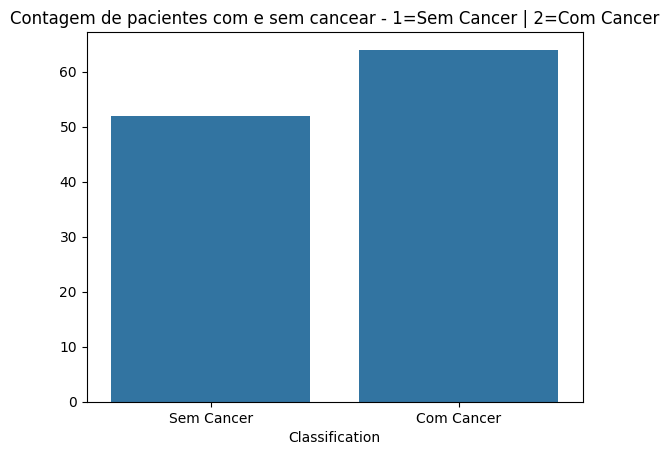
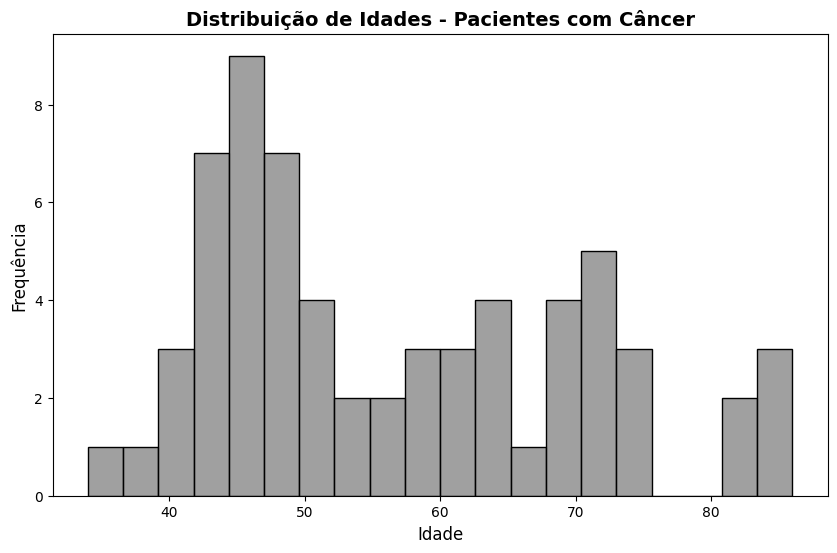
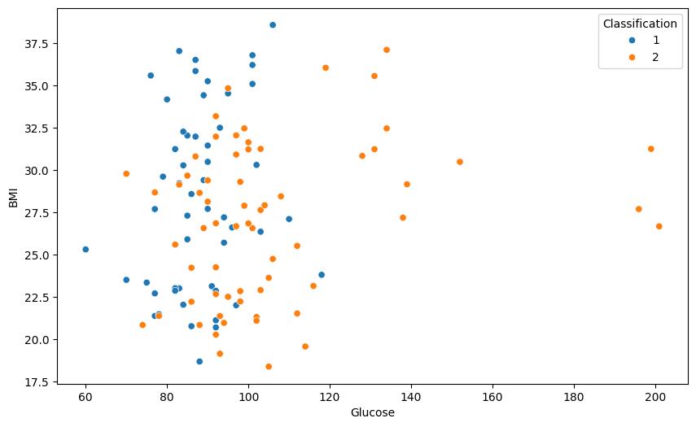
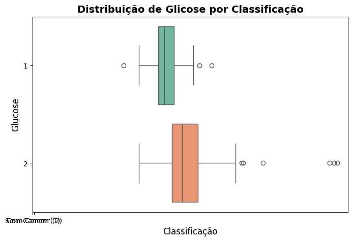
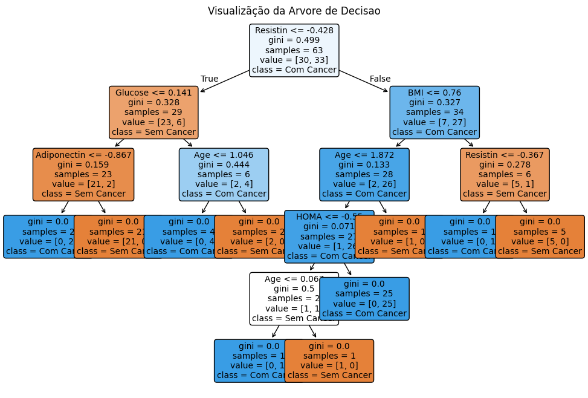
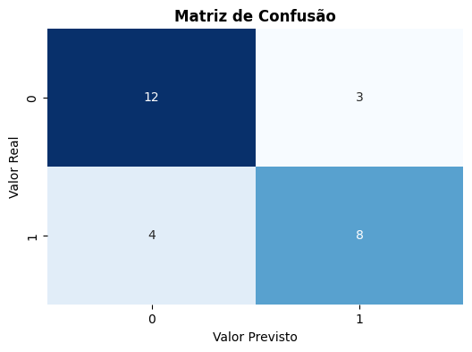
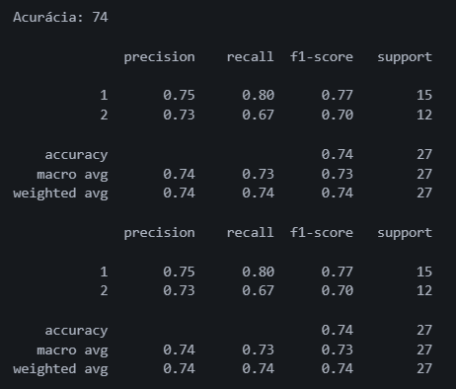

# Pipeline de Estudo de Modelo de Classificação: Breast Cancer Coimbra via Árvore de Decisão

Este repositório documenta um pipeline completo e estruturado de Machine Learning supervisionado focado na aplicação do algoritmo **Decision Tree Classifier**, utilizando o dataset público **Breast Cancer Coimbra** para prever a presença ou ausência de câncer com base em biomarcadores clínicos.

---

## 📋 Sumário do Pipeline

1. [Importação das Bibliotecas](#-importação-das-bibliotecas)
2. [Coleta e Carga dos Dados](#1-coleta-e-carga-dos-dados)
3. [Tratamento e Limpeza](#2-tratamento-e-limpeza)
4. [Análise Exploratória (EDA)](#3-análise-exploratória-eda)
5. [Balanceamento de Dados](#4-balanceamento-de-dados)
6. [Separação de Treino e Teste](#5-separação-de-treino-e-teste)
7. [Padronização das Escalas](#6-padronização-das-escalas)
8. [Modelagem e Treinamento](#7-modelagem-e-treinamento)
9. [Avaliação e Resultados](#8-avaliação-e-resultados)
10. [Estudo de Conclusão](#-conclusão-do-estudo)

---

## 📦 Importação das Bibliotecas

Bibliotecas utilizadas para manipulação, pré-processamento, modelagem e visualização gráfica:

- `pandas`, `numpy`
- `matplotlib.pyplot`, `seaborn`
- `sklearn.model_selection.train_test_split`
- `sklearn.metrics.accuracy_score`, `classification_report`, `confusion_matrix`
- `sklearn.preprocessing.StandardScaler`
- `sklearn.tree.DecisionTreeClassifier`, `plot_tree`
- `imblearn.under_sampling.RandomUnderSampler`, `TomekLinks`

---

## 🔍 Etapas do Pipeline

### 1. Coleta e Carga dos Dados

- Carregamento do arquivo `breast_cancer.csv` via Pandas mantendo a integridade dos atributos clínicos.

### 2. Tratamento e Limpeza

- Verificação inicial de valores nulos (`isna().sum()`) e contagem de registros duplicados (`duplicated().sum()`).
- Remoção de instâncias duplicadas para evitar vieses no treinamento do modelo.
- Analise visual

#### 📊 2.1 Contagem de pacientes Com Cancer e Sem Cancer

#### 📊 .2 Histograma da Distribuição de Idades - Pacientes com Câncer

#### 📊 2.3 Gráfico de Dispersão

#### 📊 2.4 Gráfico de Boxplot

### 3. Análise Exploratória (EDA)

- Extração de estatísticas descritivas, médias de glicose agrupadas por classe e geração de gráficos analíticos para compreensão profunda dos dados.

### 4. Balanceamento de Dados

- Aplicação combinada de **Random Under-Sampler** e **Tomek Links** para corrigir assimetrias entre as classes do dataset.

### 5. Separação de Treino e Teste

- Particionamento da base equilibrada utilizando `train_test_split` (proporção 70% treino e 30% teste) com `random_state=42`.

### 6. Padronização das Escalas

- Aplicação do `StandardScaler` para normalizar as variáveis numéricas, garantindo a estabilidade matemática no aprendizado da árvore.

### 7. Modelagem e Treinamento

- Configuração e ajuste de uma **Árvore de Decisão** (`DecisionTreeClassifier`) com hiperparâmetro `max_depth=10` e `random_state=0`.
- Analise visual

#### 📊 7.1 Arvore de Decisão

### 8. Avaliação e Resultados

- Geração da Matriz de Confusão, Relatório de Classificação (_precision_, _recall_, _f1-score_), cálculo da acurácia do modelo e plotagem da árvore de decisão resultante.
- Analise visual

#### 📊 8.1 Matriz de Confusão

#### 📊 8.2 Relatório de Classificação

---

## 💡 Conclusão do Estudo

A aplicação deste pipeline estruturado de classificação demonstrou a eficácia do uso de Árvores de Decisão para predições diagnósticas baseadas em biomarcadores:

1. O pré-processamento rigoroso (limpeza de duplicatas, balanceamento e escalonamento) permitiu que o modelo aprendesse padrões consistentes sem desequilíbrios acentuados.
2. O modelo alcançou uma acurácia sólida e métricas de desempenho equilibradas, comprovadas pela matriz de confusão e pelo relatório de classificação.
3. A análise evidenciou que biomarcadores como a **Resistin** e a **Glucose** desempenham papéis fundamentais na separação lógica das classes de pacientes, validando a robustez da abordagem preditiva.

---

**Autor:**  
Moisés Santos  
GitHub: [IMoisasZ](https://github.com/IMoisasZ)  
E-mail: mopri08@gmail.com
